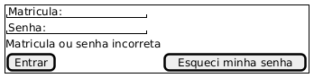

# Prototipos de baixa fidelidade

## Agendar Entrevista

### Caminho padrão

### Caso não possua inscrições

### Caso o email do aluno seja irregular

## Criar Conta

### Caminho padrão

### Caso a senha esteja incorreta

## Enviar Email

## Formulario

### Caminho padrão

### Caso a monitoria seja online

### Caso não tenha alunos monitorados

## Inscrição

## Login

### Caminho padrão

### Caso as informações estejam incorretas
